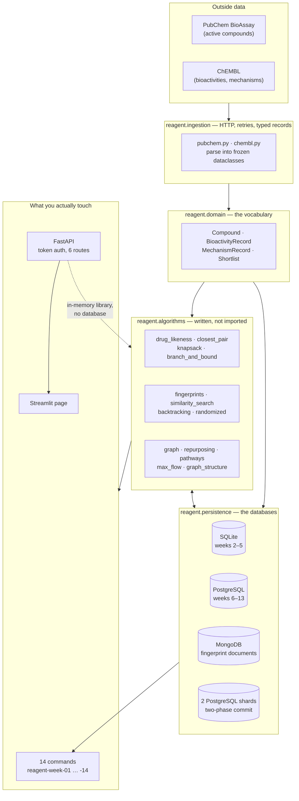

# Architecture

This document describes the as-built architecture at the end, once
tasks are applied. It is a plan for future work

## Repository layout

```text
reagent/
├── .github/workflows/ci.yml         
│      
├── src/
│   └── reagent/
│       ├── ingestion/      # External clients, normalization, provenance
│       ├── domain/         # Core molecular and bioactivity models
│       ├── persistence/    # SQLite, PostgreSQL, and MongoDB adapters
│       ├── algorithms/     # Hand-implemented search, ranking, and graph logic
│       ├── api/            # FastAPI routes, auth, and Pydantic schemas
│       ├── ui/             # Streamlit demonstration and API client
│       ├── viz/            # NetworkX-backed diagram rendering
│       └── scripts/        # The 14 reagent-week-NN CLI entry points
├── tests/                  # Mirrors src/reagent by responsibility
├── ARCHITECTURE.md
├── CONTRIBUTING_TO_YOURSELF.md
├── ECOSYSTEM_MAP.md
├── NOTES.md
├── ROADMAP.md
├── SYSTEM_DESIGN.md
└── docker-compose.yml
```


## Service boundaries

- **Ingestion adapters** (`reagent.ingestion`) communicate with ChEMBL and PubChem, translate provider payloads, attach provenance, and pass validated records to the rest of the system.
- **Persistence adapters** (`reagent.persistence`) are the only components that speak directly to SQLite, PostgreSQL, or MongoDB; domain and algorithm code depend on typed records rather than database clients.
- **Algorithms** (`reagent.algorithms`) implement filtering, searching, similarity, ranking, and graph procedures without HTTP or database-specific concerns, so each is testable with plain data.
- **Weekly scripts** (`reagent.scripts`, exposed as the 14 `reagent-week-01` … `reagent-week-14` CLI entry points) are what coordinates ingestion, persistence, and algorithms into the runnable use case for each week.
- **API** (`reagent.api`) validates external contracts with Pydantic, enforces token auth with roles (reader/curator/admin), and serves an in-memory demonstration library rather than the PostgreSQL/MongoDB stores the weekly scripts build.
- **Graph projection** (`reagent.algorithms.graph`, `repurposing`, `pathways`) constructs an in-memory analytical graph from durable evidence; hand-written algorithms operate on it and NetworkX validates their outputs.
- **UI** (`reagent.ui`) is a Streamlit page that calls the API through a typed client, not the databases or algorithm modules directly.

PostgreSQL owns canonical structured facts and integrity. MongoDB owns retained variable source documents and flexible annotations. IDs and provenance link the two stores, but cross-store consistency is coordinated by the weekly scripts rather than pretending both stores share one transaction manager. The deployed API is deliberately database-free — see the note under Data flow below.

## Data flow



Two rules explain most of the shape:

1. **Data flows one way** — outside → ingestion → domain → algorithms →
   persistence → surfaces. `algorithms/` imports no HTTP client and no database
   driver, which is why every algorithm is testable with a list of dataclasses
   and no infrastructure.
2. **The API is deliberately database-free.** It builds a twelve-compound
   library in memory, so it can be deployed anywhere and run by anyone. The
   databases are where the *DBMS course* lives, and they are exercised by the
   fourteen weekly commands, not by the deployed API.

## Technology stack

| Tool | Purpose and justification |
|---|---|
| Python 3.11+ | Provides modern typing, a readable learning language, and strong scientific and web ecosystems. |
| Git and GitHub | Preserve incremental work, support review, and make each week's evolution auditable. |
| SQLite | Supplies a zero-configuration relational learning environment for Weeks 1–5 only before the production migration. |
| PostgreSQL | Provides the final relational system of record with robust constraints, transactions, indexing, and query planning. |
| SQLAlchemy | Separates persistence mappings from domain logic while exposing both SQL expression and ORM concepts. |
| MongoDB with pymongo | Stores heterogeneous provider documents and teaches direct, explicit document-database access. |
| RDKit | Supplies chemically correct parsing, descriptors, and fingerprints while custom code implements the core CS algorithms around them. |
| PubChemPy | Provides a focused Python client for retrieving PubChem compounds and metadata. |
| chembl_webresource_client | Provides supported access to ChEMBL targets, assays, compounds, and bioactivities. |
| FastAPI and Pydantic | Deliver a typed, validated API with generated documentation and explicit boundary contracts. |
| NetworkX | Validates and visualizes graph results only; Reagent hand-implements the algorithms being studied. |
| pytest | Supports readable unit, integration, and regression tests throughout the cumulative build. |
| Docker and Docker Compose | Reproduce the multi-service environment consistently on student, CI, and demonstration machines. |
| GitHub Actions | Runs automated validation on every change and records whether the cumulative system remains healthy. |
| Streamlit | Turns scientific and algorithmic results into an approachable interactive demonstration with little UI overhead. |
| MkDocs | Publishes the weekly teacher-to-student material and architecture documentation as a navigable study site. |