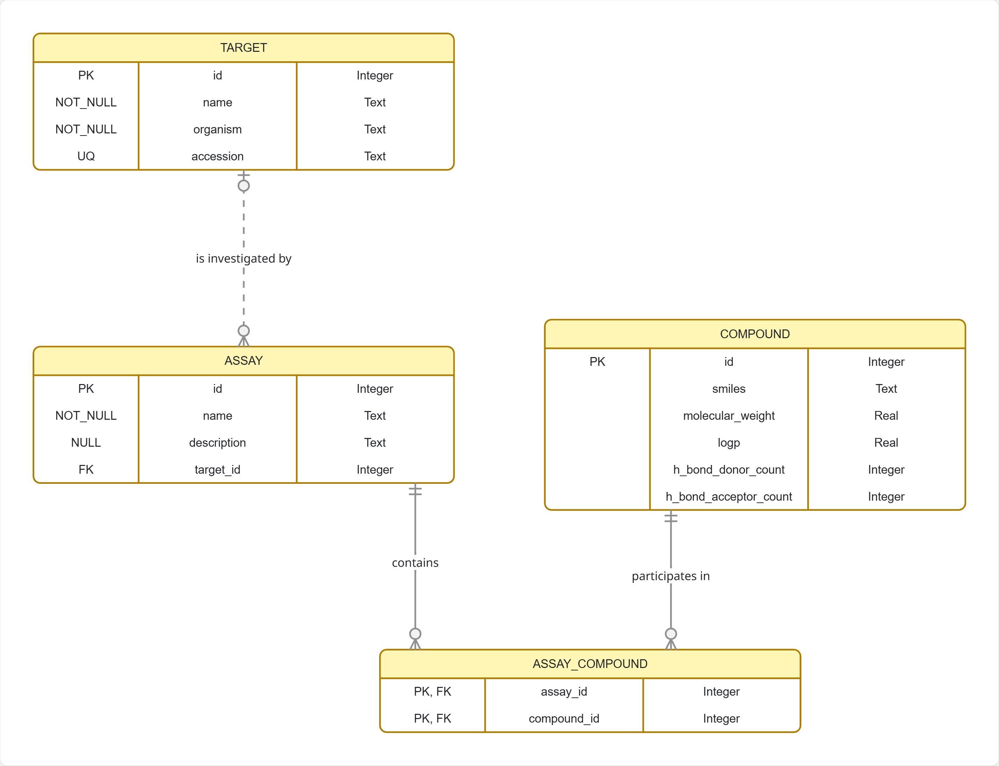

### Description

**Target** - Biological subject with a unique integer ID, required name and organism, and optional unique accesssion. A target is investigated by zero or many Assays. An assay can point to zero or one Target. 

**Assay** - Records an experiment with a PubChem assay ID, required name, optional description, and optional Target reference. One Assay has zero or many Assay-Compound rows.

**Compound** - It Preserves all si properties of Python Class. One Compound can have zero or many Assay-Compound rows.

**Assay-Compound** - Associative entity for many to many relationship, an assay can contain many compounds, and a compound can participate in many assays. Its two foreign keys form one composite primary key, preventing the same compound from being associated with the same assay twice. 